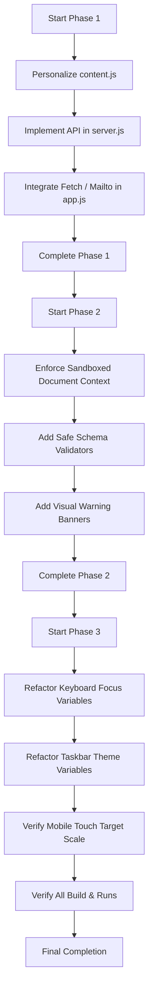

# Design Specification: Vibe OS Retro Desktop Portfolio Hardening & Polish

**Date:** 2026-06-20  
**Status:** PROPOSED  
**Author:** Antigravity (Google DeepMind)

---

## 1. Overview & Objectives

This specification details a coordinated set of improvements to transform the **Vibe OS Retro Desktop Portfolio** from a structural MVP into a fully functional, production-ready, and high-quality experience. The enhancements are structured into three sequential phases:

1.  **Phase 1: Shell & Content Polish** — Personalize portfolio copy, replace placeholders, and implement a robust contact form submission pipeline with a static `mailto:` fallback.
2.  **Phase 2: AI App Forge Hardening** — Introduce script isolation via a shadowed `document` context proxy, enforce schema validation bounds on dynamic manifests, and style visual fallback notices for offline modes.
3.  **Phase 3: Visual System & Responsive Audit** — Integrate theme-aware accessibility outlines (`:focus-visible`), refactor static taskbar gradients to adapt to theme changes, and optimize mobile touch targets.

---

## 2. Phase 1: Shell & Content Polish

### 2.1 Content Customization ([content.js](file:///C:/Users/yash/cse/proj/portfolio/content.js))
Update the generic portfolio fields with tailored developer copy:
*   **Name:** Yash Kalani
*   **Role:** Systems-Oriented Product Engineer
*   **Email:** `yash@kalani.dev`
*   **GitHub/LinkedIn Handles:** `ykalani`

### 2.2 Contact API Endpoint ([server.js](file:///C:/Users/yash/cse/proj/portfolio/server.js))
Add a new `POST /api/contact` endpoint to intercept, validate, and store messages locally.
*   **Routing:** Check `req.url === "/api/contact" && req.method === "POST"`.
*   **Payload Schema:**
    ```json
    {
      "name": "string",
      "email": "string",
      "message": "string"
    }
    ```
*   **Validation:** Return `400 Bad Request` if any fields are empty or if the email is invalid.
*   **Persistence:** Append valid submissions to `contact_messages.json` inside the root workspace directory with a timestamp and numeric ID.

### 2.3 Async UI Trigger ([app.js](file:///C:/Users/yash/cse/proj/portfolio/app.js))
Intercept contact form submissions asynchronously:
1.  Prevent default form action.
2.  Change action button text to `"Sending..."` and lock inputs.
3.  Execute `fetch("/api/contact", { method: "POST", body: JSON.stringify(...) })` with a `3000ms` abort timeout.
4.  **On Success:** Update status text to `"Message submitted successfully!"`
5.  **On Failure (or timeout):** Update status text to `"API offline, opening mail client..."` and fall back to opening:
    ```javascript
    window.location.href = `mailto:${portfolio.email}?subject=...&body=...`;
    ```

---

## 3. Phase 2: AI App Forge Hardening

### 3.1 Script Context Isolation ([app.js](file:///C:/Users/yash/cse/proj/portfolio/app.js))
To safeguard the outer window manager from generated dynamic scripts, we shadow the global `document` keyword inside the dynamic evaluation wrapper.

*   **Shadowing Proxy:**
    ```javascript
    const sandboxedDocument = {
      querySelector: (sel) => container.querySelector(sel),
      querySelectorAll: (sel) => container.querySelectorAll(sel),
      getElementById: (id) => container.querySelector(`#${id}`),
      getElementsByClassName: (cls) => container.getElementsByClassName(cls),
      getElementsByTagName: (tag) => container.getElementsByTagName(tag),
      createElement: (tag) => document.createElement(tag),
      createTextNode: (txt) => document.createTextNode(txt),
      body: container,
      addEventListener: (...args) => container.addEventListener(...args),
      removeEventListener: (...args) => container.removeEventListener(...args)
    };
    ```
*   **Execution:**
    ```javascript
    const scriptFunc = new Function("container", "state", "document", windowDef.js);
    scriptFunc(container, state, sandboxedDocument);
    ```

### 3.2 Safe Schema Validation ([app.js](file:///C:/Users/yash/cse/proj/portfolio/app.js))
Add checks in `registerGeneratedWindow` before appending dynamic definitions to state:
*   Fallback defaults for window dimension bounds:
    ```javascript
    const width = (manifest.window && typeof manifest.window.width === "number") ? manifest.window.width : 450;
    const height = (manifest.window && typeof manifest.window.height === "number") ? manifest.window.height : 380;
    ```
*   Fallback defaults for missing title and description.

### 3.3 Visual Fallback Warnings ([generator.js](file:///C:/Users/yash/cse/proj/portfolio/generator.js) / [app.js](file:///C:/Users/yash/cse/proj/portfolio/app.js))
If the window manifest is compiled offline via local templates due to a failed API connection:
*   Add a warning class `.window--offline-fallback` to the outer container.
*   Prepend a noticeable yellow warning banner to the body:
    ```html
    <div class="offline-warning-banner">
      <span class="pixel-icon icon-warning"></span>
      <span>Running in offline simulation. Configure GEMINI_API_KEY to enable live AI generation.</span>
    </div>
    ```

---

## 4. Phase 3: Visual System & Responsive Audit

### 4.1 Theme-Aware Keyboard Focus ([styles.css](file:///C:/Users/yash/cse/proj/portfolio/styles.css))
Refactor focus borders so they remain visible across dark and neon backgrounds:
*   Use a CSS variable for focus visibility:
    ```css
    :focus-visible {
      outline: 2px solid var(--focus-outline, #000000) !important;
      outline-offset: 2px;
    }
    ```
*   Add custom `--focus-outline` values to all theme overrides:
    *   Classic Redmond: `#000000`
    *   Synthwave/Cyberpunk: `#00ffff` (Cyan glow)
    *   Glassmorphic: `#ffffff` (White overlay)
    *   Matrix: `#1eff00` (Terminal green)

### 4.2 Theme-Aware Taskbar Styling ([styles.css](file:///C:/Users/yash/cse/proj/portfolio/styles.css))
Replace hardcoded light-grey colors on the taskbar with variables that adapt dynamically to the theme class toggled on the `body` element:
*   Taskbar component styles:
    ```css
    .taskbar {
      background: var(--taskbar-bg, linear-gradient(180deg, #d8d8d8, #b6b6b6));
    }
    .taskbar__start, .taskbar__window {
      background: var(--taskbar-btn-bg, linear-gradient(180deg, #dedede, #bdbdbd));
    }
    .taskbar__clock {
      background: var(--taskbar-clock-bg, #ececec);
    }
    ```
*   Update active theme classes (`body.theme-classic`, `body.theme-cyberpunk`, etc.) to define values matching the rest of the window chrome gradients.

### 4.3 Responsive touch target scales ([styles.css](file:///C:/Users/yash/cse/proj/portfolio/styles.css))
Ensure touch compliance under the `max-width: 900px` mobile breakpoint by guaranteeing active window close buttons and taskbar buttons maintain a touch height target of at least `32px`.

---

## 5. Implementation Sequence


